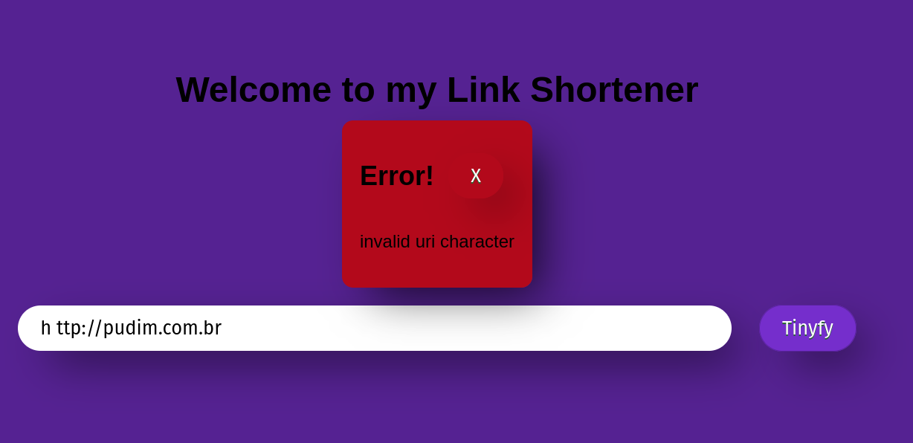
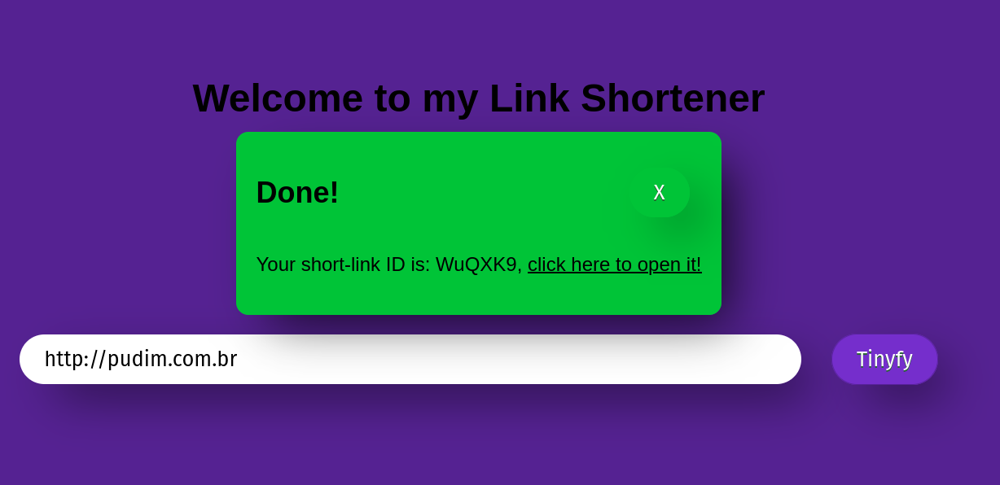

# Welcome to my link shortener server written in Rust

A simple server that recieves a long url as parameter and returns a tiny-url (that can be expanded).

Built originally with [hyper](https://hyper.rs/), now using [warp](https://github.com/seanmonstar/warp) to handle HTTP requests and [diesel](https://diesel.rs/) to interact with psql.

## Features

1. Link _SHORTENER_, duh, it'll save the long-link alongside an unique ID that can be accessed by going to the ID's path like: `http(s)://<server link>/<short-link-id>`
1. HTTP validator (will only accept HTTP(s) links).
1. User Auth/Register/Login using JWT tokens.

## How it looks?

The server sends JSON with the containing error message:

Or the success link id + a hyperlink:

## Running the server locally

### Docker

This server is meant to be run as a docker container.

There's a Docker-compose file that can be run with `docker-compose up`

### Cargo

You can also do `RUST_LOG="info" cargo run`

## Links I used to learn

[Idea from here](https://www.goldsborough.me/rust/web/tutorial/2018/01/20/17-01-11-writing_a_microservice_in_rust/)

[Setting up Diesel - with .env](https://diesel.rs/guides/getting-started)

[Basic `psql` setup on ubuntu](https://www.cherryservers.com/blog/how-to-install-and-setup-postgresql-server-on-ubuntu-20-04)

[URL Parsing - implemented in `parser.rs`](https://www.secretfader.com/blog/2019/01/parsing-validating-assembling-urls-rust/)

# TODOS

I'll add here some ideas I'm having for this project.

1. ~~Implement a function that checks for duplicated short URLs~~
   _>I used unique PSQL fields for this_
1. Create separate function for [the random key generator](https://github.com/pedromarquetti/tiny-link/blob/207c3ec50c536227c535760ba09a8c3f4c620c34/src/db.rs#L16)
1. Add functionality to users
   1. maybe enable users to create custom IDs?
   1. Make anon. links time-limited, and making user links infinite?
   1. Public/private links?
